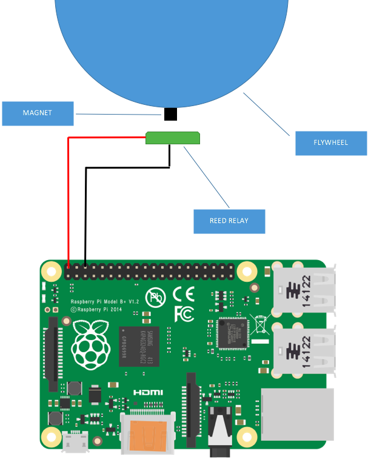

# RPM sensor

## Introduction
For this challenge, the idea is to cover the distance from earth to space station and moon
virtually. To do so, we use a bike that's installed on a home trainer.
Then all we have to do is to measure the distance we've gone  through and
display it on a web page.

This part of the repo describes the setup used to measure distance
directly form the home trainer.

## Hardware setup
To measure the distance, we first needed to measure RPM directly on the home
trainer. To do so, we glued a neodymium magnet directly onto the flywheel
and attach a reed sensor and read RPM with a raspberry pi from it.

The reed is like a switch that closes when a magnet is near it.

## Software setup
On the Raspberry Pi, we've setup a simple script that does two things:

- run a thread that counts number of times that switch closes (or button is pressed)
- run a simple HTTP server to display number of turns.
